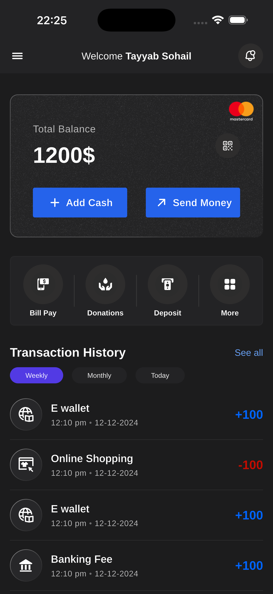
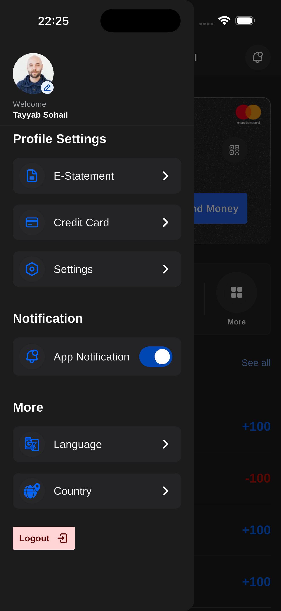
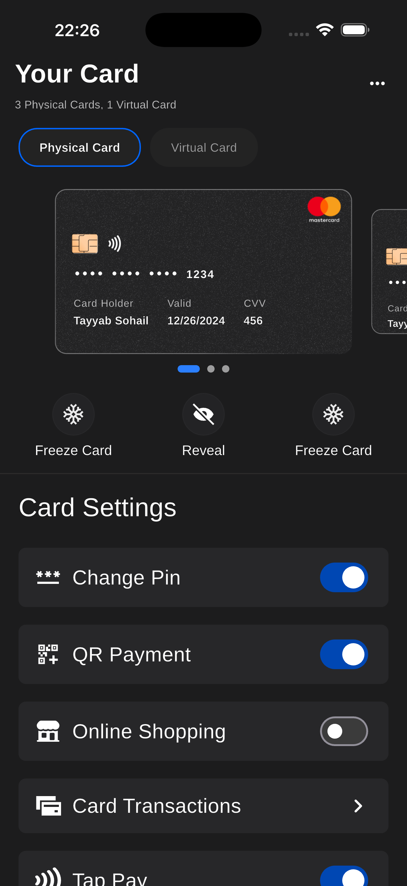
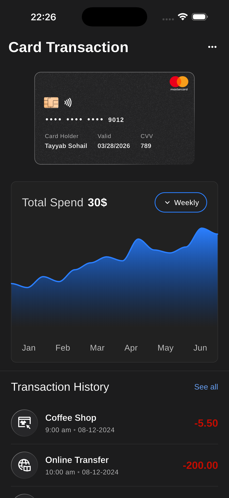

# Mintyn Mobile App — Technical Assessment

## Overview

This is a Flutter-based technical assessment for the Mobile App Developer position at **Mintyn**. The project implements the **Dashboard** and **Cards** screens from a Figma design using Flutter, integrated with mocked data and featuring a clean, interactive, and responsive UI.

---

## Demo

[Google Drive Link to Mintyn Demo](https://drive.google.com/file/d/1m_opDQm6Qos3bOQ55yiAZJNP3aJHJosh/view?usp=drive_link)

## Assessment Objectives

| Criteria                        | Description                                                                                            |
| ------------------------------- | ------------------------------------------------------------------------------------------------------ |
| **Accuracy to Design**          | Close replication of the Figma design with attention to spacing, typography, and component consistency |
| **Animations & Transitions**    | Smooth, consistent, and performant entrance animations and page transitions                            |
| **Architecture & Code Quality** | Clean Architecture with OOP principles, proper state management, modular and scalable structure        |
| **API Integration**             | Efficient mock data handling, error handling, and resilience patterns                                  |
| **Performance & Optimization**  | Smooth scrolling, shimmer loading states, no unnecessary re-renders                                    |
| **Testing & Maintainability**   | Codebase structured for maintainability; mock library configured                                       |
| **Best Practices**              | Responsive layouts, Flutter/Dart best practices, progressive Git commits                               |

---

## Features Implemented

### Dashboard Screen

- **Balance Card** — Dynamic balance display loaded from mocked JSON with holder name and currency
- **Quick Actions** — Deposit, Bill Pay, Donations, and More action buttons
- **Transaction History** — Tabbed filter (Today / Weekly / Monthly) with Cubit-driven list updates
- **Side Drawer** — Navigation drawer accessible from the hamburger menu

### Cards Screen

- **Physical & Virtual Tabs** — Toggle between card types with a dynamic count subtitle
- **Card Carousel** — Swipeable card carousel with a smooth page indicator
- **Shimmer Loading** — Skeleton loading state while cards are fetched from the mock datasource
- **Card Settings** — Per-card toggle settings (Change PIN, QR Payment, Online Shopping) auto-synced from the active card's model
- **Card Transactions Screen** — Dedicated screen showing the selected card's details, spending chart, and a transaction history list

### Animations

All screens feature staggered entrance animations powered by the custom `SmartAnimate` component:

| Screen            | Section            | Preset          | Delay  |
| ----------------- | ------------------ | --------------- | ------ |
| Dashboard         | Balance card       | `fadeSlideUp`   | 0 ms   |
| Dashboard         | Quick actions      | `fadeSlideUp`   | 80 ms  |
| Dashboard         | Transaction header | `fadeSlideUp`   | 160 ms |
| Dashboard         | Filter tabs        | `fadeSlideUp`   | 210 ms |
| Dashboard         | History list       | `fadeSlideUp`   | 260 ms |
| Cards             | Tab row            | `fadeSlideDown` | 0 ms   |
| Cards             | Card carousel      | `scale`         | 80 ms  |
| Cards             | Page indicator     | `fadeIn`        | 150 ms |
| Cards             | Quick actions      | `fadeSlideUp`   | 200 ms |
| Cards             | Settings toggles   | `fadeSlideUp`   | 260 ms |
| Card Transactions | Card preview       | `scale`         | 0 ms   |
| Card Transactions | Spending chart     | `fadeSlideUp`   | 100 ms |
| Card Transactions | Transaction list   | `fadeSlideUp`   | 180 ms |

---

## Architecture

The project follows **Clean Architecture** with strict layer separation per feature:

```
feature/
├── data/           → Datasources, Models (freezed), Repository Implementations
├── domain/         → Abstract Repositories, UseCases
└── presentation/   → Cubits, Views, Widgets
```

### Key Design Decisions

- **State Management** — `flutter_bloc` (Cubit) with `freezed` sealed state classes (`initial | loading | loaded | error`)
- **Dependency Injection** — `get_it` + `injectable` with `build_runner`-generated registration; services are `@LazySingleton` or `@injectable`
- **Error Handling** — Functional `Either<Failure, T>` via `dartz`; a custom `EitherSafeRunner` wraps all async datasource calls
- **Mock Data** — Three JSON files in `assets/data/` simulate real API responses with configurable delays; swapping to live endpoints only requires changing the datasource implementation
- **Routing** — Named routes via a central `RoutesGenerator`; typed arguments extracted at the route level
- **SmartAnimate** — Custom animation wrapper with 12 presets and configurable duration/delay/curve for staggered screen entrances
- **Dark Mode First** — Themed for dark mode (`ThemeMode.dark`) to match the Figma specification
- **Analysis** — Strict lint rules configured via `analysis_options.yaml` for consistent, high-quality Dart code

---

## Tech Stack

All dependencies and their versions are listed in [`pubspec.yaml`](./pubspec.yaml).

---

## Project Structure

```
mintyn/
├── lib/
│   ├── main.dart
│   ├── bootstrap.dart
│   ├── app/                   # MaterialApp, BlocProviders, Hive adapters
│   ├── config/                # Routing, ThemeData
│   ├── core/                  # Shared components, constants, error, DI, extensions
│   ├── features/
│   │   ├── splash/
│   │   ├── home/              # Dashboard — balance, history, quick actions
│   │   └── card/              # Cards — carousel, settings, transactions
│   ├── utils/                 # EitherSafeRunner, logger
│   └── gen/                   # FlutterGen type-safe asset & font constants
├── assets/
│   ├── data/                  # balance.json, card.json, transaction.json
│   ├── font/
│   ├── icons/
│   └── images/
├── test/
├── analysis_options.yaml
└── pubspec.yaml
```

---

## Getting Started

### Prerequisites

- **FVM** — This project uses [FVM](https://fvm.app) to manage the Flutter SDK version. The pinned version is defined in `.fvmrc` and can be confirmed there.

  ```bash
  # Install FVM (if not already installed)
  dart pub global activate fvm

  # Install the pinned Flutter version
  fvm install

  # Use it for all commands in this project
  fvm flutter --version
  ```

- **IDE** — Android Studio, VS Code, or Xcode (with the Flutter & Dart plugins)
- **Git**

### Installation

1. **Clone the repository:**

   ```bash
   git clone https://github.com/onaya7/mintyn_flutter_test.git
   cd mintyn_flutter_test
   ```

2. **Install dependencies:**

   ```bash
   fvm flutter pub get
   ```

3. **Run code generation** _(required for freezed / injectable / json_serializable)_:

   ```bash
   fvm dart run build_runner build --delete-conflicting-outputs
   ```

4. **Run the app:**

   ```bash
   fvm flutter run
   ```

### Building Release Artifacts

```bash
# Android APK
fvm flutter build apk --release

# Android App Bundle
fvm flutter build appbundle --release

# iOS
fvm flutter build ios --release
```

---

## Development Guidelines

- Follow the [Dart Style Guide](https://dart.dev/guides/language/effective-dart/style)
- Follow the [Very good analysis rules](https://pub.dev/packages/very_good_analysis) for linting
- Use meaningful, descriptive commit messages
- Keep commits focused and progressive — one logical change per commit
- Test on both mobile (iOS/Android) and web platforms
- Always prefix Flutter/Dart commands with `fvm` to ensure the correct SDK version is used

---

## App Screenshots

| Splash                                                 | Dashboard                                                 | Profile                                                 | Cards                                                 | Card Transactions                                                 |
| ------------------------------------------------------ | --------------------------------------------------------- | ------------------------------------------------------- | ----------------------------------------------------- | ----------------------------------------------------------------- |
|  |  |  |  |  |

---

## Implementation Notes

- **Code generation must be run before the first build.** `build_runner` generates `.freezed.dart`, `.g.dart`, and `injection.config.dart` files that are not committed to the repository.
- **`.env` file** — The project uses `flutter_dotenv`. An empty `.env` file at the project root is sufficient for local development; no live API calls are made.
- **Card Settings Sync** — Card settings toggles are automatically synced from the active `CardModel.settings` whenever the carousel page changes, driven by `BlocListener`.
- **Shimmer Skeletons** — The `_CardCarouselShimmer` widget matches the exact card height (178 px) for a seamless loading-to-loaded transition without layout shifts.
